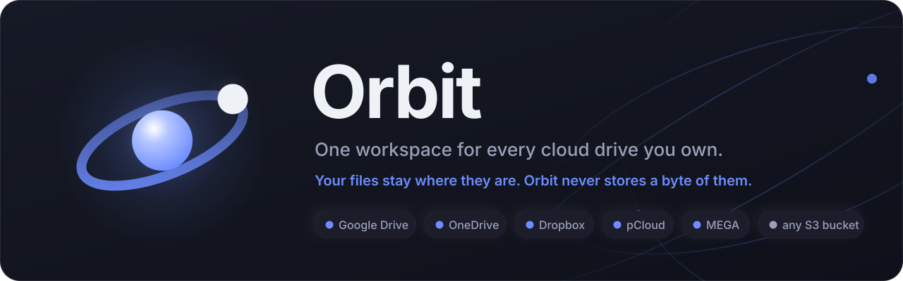

# Orbit

Orbit aggregates Google Drive, OneDrive, Dropbox, pCloud, MEGA, and any
S3-compatible bucket behind a single, consistent interface — browse, upload,
download, share, and manage files across every connected account without
switching tabs.

**Running your own copy:** [`docs/08-self-hosting.md`](docs/08-self-hosting.md).
Four commands to a working instance; no Docker, no database server, no keys
needed to start.

Orbit never stores your files. It keeps metadata and encrypted credentials, and streams bytes
on demand from the provider they already live in. That single rule is what keeps it free to
run: no storage bill, no egress bill, nothing to accumulate.

## Features

- **Multi-provider aggregation** — connect several accounts, including multiple accounts from
  the same provider, all normalised through one adapter layer. A provider whose keys this
  instance does not have says "coming soon" rather than offering a button that fails.
- **Unified workspace** — Home, My Drive, Recent, Starred, Shared with me, Bin, Collections and
  Quota, over a provider-agnostic virtual path.
- **Storage breakdown** — what is actually using the space, by photos, video, audio, documents,
  archives, code and other, with per-account filtering.
- **File management** — browse, create folders, rename, star, delete or bin, and move and copy
  *between* providers. Select a page or every page, and bulk actions run as a background job:
  they carry on, and keep reporting from the header, when you navigate somewhere else.
- **Search and filters** — search the whole drive rather than the loaded page, filtered by type,
  size, and age bands for modified and created date. A drive that cannot answer a filter does
  not show it.
- **Large folders** — a folder loads in full, however many files it has, and pages over the
  result rather than stopping at a cap. The Bin works the same way.
- **Rate limits handled rather than reported** — every provider call backs off and retries when
  the service says to slow down, including Google's habit of answering a rate limit with `403`
  rather than `429`. A permission refusal, which looks identical, is not retried.
- **Uploads** — drag-and-drop, folder upload, resumable transfers where the provider supports
  them, live progress over WebSocket, and automatic account selection via a configurable
  allocation strategy.
- **Sharing** — short links on your own domain plus QR codes; the underlying provider URL is
  never exposed.
- **Direct transfer** — browser-to-browser handoff over WebRTC, with no relay and no bytes
  through Orbit. Roughly one connection in ten cannot be made without a TURN server, and Orbit
  says so instead of buying bandwidth.
- **Duplicates** — find identical files across every connected account and clear them out.
- **Sync** — a scheduled delta pass into a local metadata mirror, every fifteen minutes.
  Providers without a delta feed are re-listed in the background. The mirror backs the storage
  breakdown and the duplicate finder; browsing and search go to the provider, because the mirror
  does not model folders (ADR 0015 records why that was tried and reversed).
- **Developer platform** — a versioned public API, OAuth apps with PKCE, webhooks, and in-app
  API documentation.
- **Auth** — passwordless email OTP in hosted mode, single-user local mode for self-hosting.
- **RBAC** — workspace roles and a superadmin panel with an audit trail.
- **PWA** — installable, responsive from 360 px up, light/dark/system theming with an accent
  picker, and a prompt when the open tab is running a build older than the deployed one.

### Live

<https://orbit.harshitsaini.in> — the front end on Vercel, the API on Render, Turso for the
database, Resend for sign-in codes. Every one of those on a free tier, which is a constraint the
design answers to rather than a coincidence.

## Stack

React + Vite + three.js · Express + `ws` + node-cron · Drizzle ORM over libSQL/Turso ·
Playwright · TypeScript throughout, in an npm-workspaces monorepo.

## Getting started

```bash
npm install
cp .env.example .env
# generate the secrets .env needs
node -e "console.log(require('crypto').randomBytes(32).toString('base64'))"

npm run db:migrate   # migrations never run at boot - this is always a separate step

npm run dev          # api on :8787, web on :5173
```

On Windows you can skip all of that and double-click **`start.bat`** — it installs
dependencies, creates `.env` and the database on first run, then opens both servers in their own
windows. **`stop.bat`** shuts them down, **`restart.bat`** does both.

Install the local git hooks once per clone:

```bash
sh scripts/install-hooks.sh
```

## Testing

```bash
npm test             # unit and integration tests (server and adapters)
npm run test:e2e     # Playwright, headed
npm run test:e2e:ci  # Playwright, headless
```

987 unit and integration tests, and 399 Playwright specs across desktop, tablet and mobile.

There is no unit-test setup in `apps/web`; front-end behaviour is covered by Playwright.
Typecheck and build per workspace — `npm run typecheck -w @orbit/web`, `npm run build -w
@orbit/web -w @orbit/server`. The root `typecheck` expects a `tsconfig.json` that does not
exist, and `build --workspaces` trips over `@orbit/adapters` having no build step; both are
noted in `docs/01-project-state.md`.

## Documentation

| Document | Contents |
|---|---|
| `docs/01-project-state.md` | Current phase, what's done, what's next |
| `docs/02-architecture.md` | Full architecture, data model, adapter contract, roadmap |
| `docs/03-api-reference.md` | Route-by-route API reference |
| `docs/04-deployment.md` | Deployment runbook |
| `docs/05-owner-setup.md` | Step-by-step account, API key, and DNS setup |
| `docs/06-developer-platform.md` | Design for the public API, OAuth apps, and API docs tab |
| `docs/07-provider-icons.md` | Where the provider marks come from, and how to swap in official ones |
| `docs/08-self-hosting.md` | **Running your own copy**, from clone to deploy |
| `docs/decisions/` | Architecture decision records, including the ones that were reversed |
| `docs/daily-log/` | Dated development log |
| `docs/assets/` | The banner above |

## Licence

MIT
