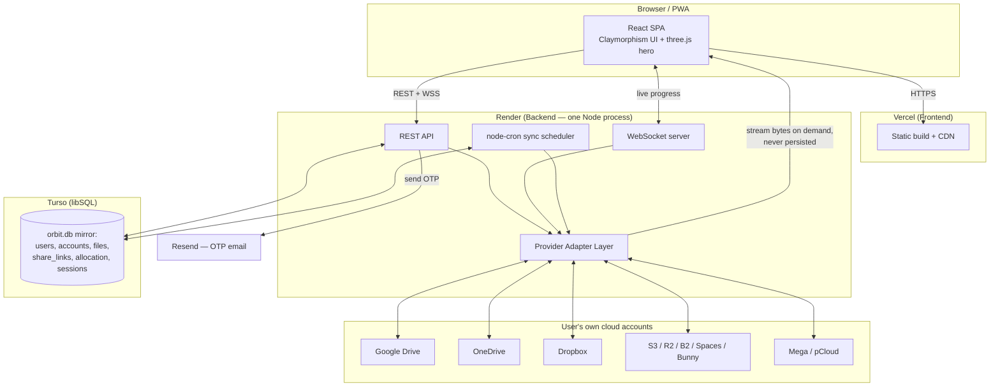
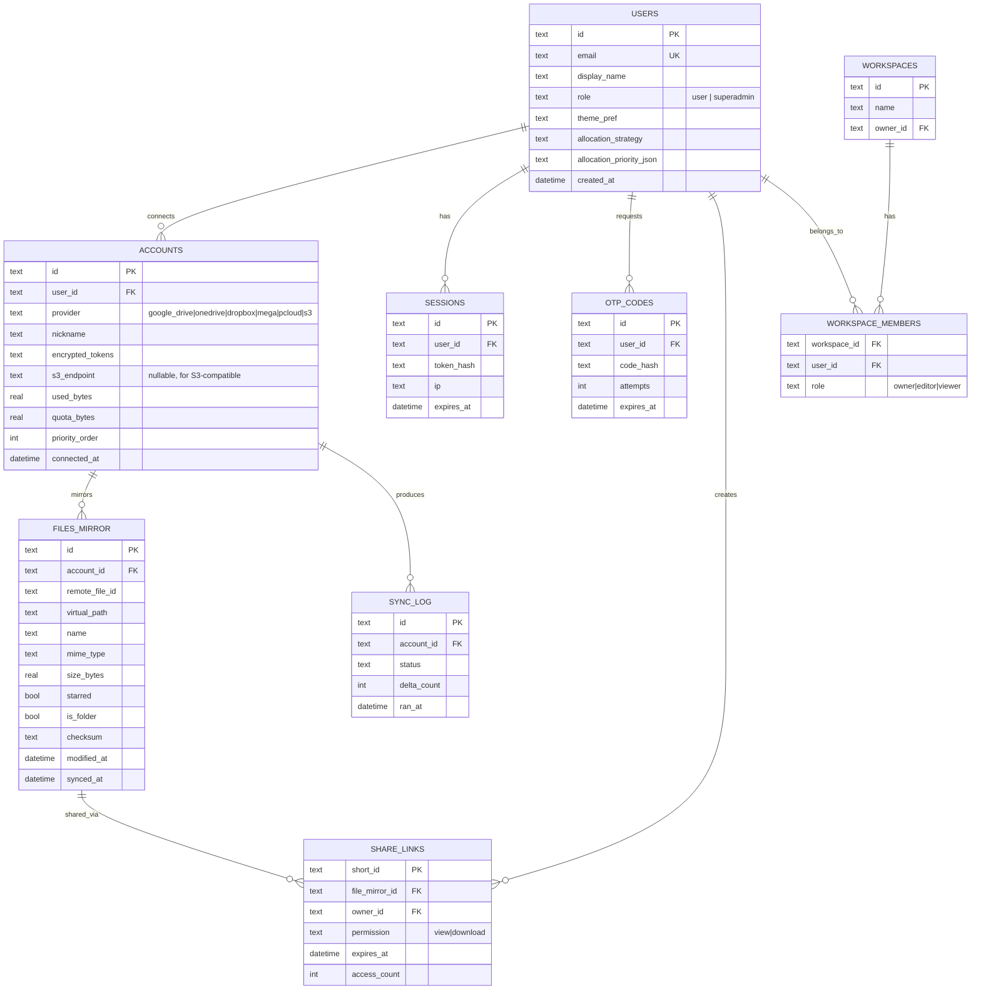
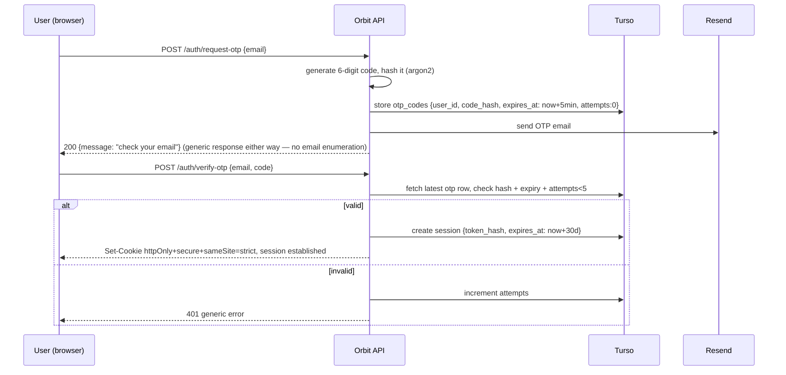
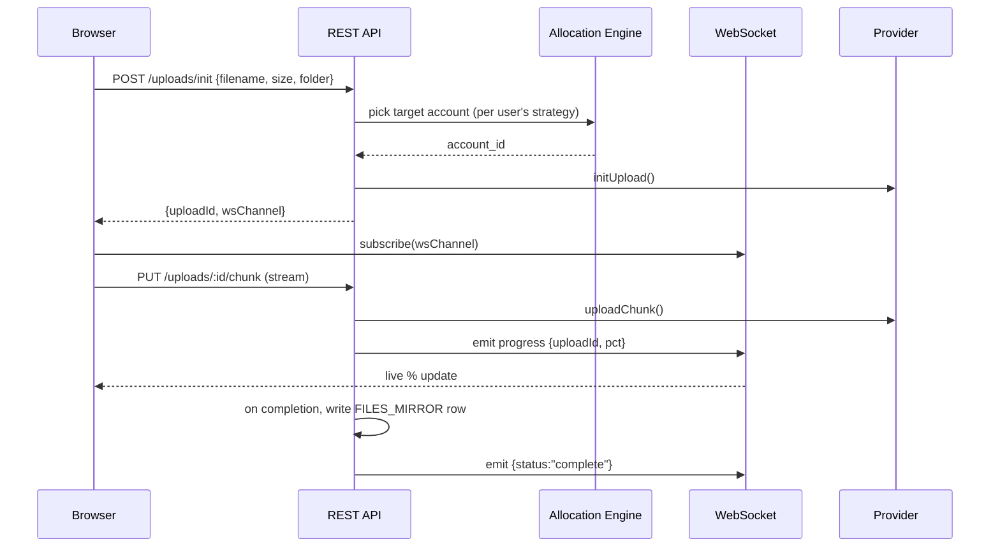

# Orbit — Master Build Plan
### Multi-cloud drive aggregator · orbit.harshitsaini.in · ₹0 / $0 cost stack

---

## 0. The one architectural decision that makes ₹0 possible

**Orbit never stores user files.** It only ever stores:
- metadata (filenames, sizes, paths, provider IDs)
- encrypted OAuth tokens / access keys
- your own app data (users, sessions, share links, allocation config)

The actual bytes always live inside the user's own Google Drive / Dropbox / S3 / etc. account. When someone downloads or previews through Orbit, the backend fetches the bytes **on demand** from the provider and streams them straight through — it never lands on Orbit's disk.

This one decision is why you don't need S3, R2, B2, or any paid bulk-storage service for Orbit itself. All you need is a small metadata database (a few hundred MB, fits in any free tier) and a backend that can proxy a stream. Everything below is built around this.

---

## 1. Zero-cost infrastructure stack

| Layer | Service | Free tier | Card needed? | Notes |
|---|---|---|---|---|
| Frontend hosting | **Vercel** (Hobby) | 100GB transfer, 1M function calls/mo, unlimited projects | **No** — free forever for personal/non-commercial use | Deploy React/Next.js frontend here |
| Backend hosting | **Render** (Free Web Service) | 750 instance-hours/mo (≈ enough for 24×7 on one service), sleeps after 15 min idle | **No** | Node/Express + WebSocket + node-cron live here |
| Metadata DB | **Turso** (libSQL — SQLite-compatible) | 5GB storage, 500M row-reads/mo, 100 databases | **No** | Same SQLite file-format/API you already planned, just cloud-hosted so it survives Render restarts |
| Transactional email (OTP) | **Resend** | 3,000 emails/mo, 100/day | **No** | Plenty for OTP volume on a personal project |
| DNS / domain routing | **Cloudflare** (DNS only, free plan) | Unlimited DNS records, free SSL/proxy | **No** (only their R2 storage product asks for a card — you won't use it) | Point orbit.harshitsaini.in here |
| CI/CD | **GitHub Actions** | Effectively unlimited minutes on **public** repos | **No** | Runs your Playwright test suite on every push |
| Source control | **GitHub** + GitHub CLI (`gh`) | Free | **No** | Public repo |
| Optional test storage target | **Backblaze B2** | 10GB storage, S3-compatible API | **No** | Only needed if you want to test the "generic S3" adapter against a real free bucket instead of local MinIO |
| Uptime pinger (optional) | **UptimeRobot** or **cron-job.org** | 5-min interval free monitor | **No** | Pings Render's `/health` every 10 min so the backend rarely cold-starts |

**Where a debit card is actually fine to use:** nothing above strictly requires payment info. The one common gotcha is **Cloudflare R2** (object storage) — it asks for a card even on its free tier, purely for identity verification, and won't charge unless you exceed 10GB/1M ops. Since Orbit doesn't need bulk storage at all (see §0), you can just skip R2 entirely and never hit this.

**About the OAuth apps** (Google Drive, OneDrive, Dropbox, Mega, pCloud): registering a developer/OAuth app on each of these platforms is free and does not require billing — you're not calling paid quota tiers, just the standard free API allowance every developer gets.

---

## 2. High-level architecture



**Component summary**

- **Frontend (Vercel):** React SPA (Vite or Next.js in static/export mode — Next isn't required since there's no server-rendering need; Vite is lighter and free-tier friendlier). PWA manifest + service worker for installability across devices.
- **Backend (Render):** single Node/Express process handling REST, a WebSocket server (`ws` or `socket.io`) for live upload progress, and `node-cron` for scheduled account sync — all in one process so you stay inside one free Render service.
- **Adapter layer:** one interface, one implementation per provider. This is the heart of the aggregation.
- **Turso:** your SQLite file, just living in the cloud so Render's ephemeral disk doesn't wipe it on redeploy. Locally (dev machine), you can point the same code at a plain local `.sqlite` file — libSQL client supports both, so `local mode` (self-hosted) can keep using a literal local file exactly as you described, and `hosted mode` (orbit.harshitsaini.in) points at Turso.

---

## 3. Data model



Use **Drizzle ORM** with the `@libsql/client` driver — it works identically against a local SQLite file and against Turso, so `local mode` vs `hosted mode` becomes a one-line env var switch (`DATABASE_URL=file:./orbit.db` vs `DATABASE_URL=libsql://your-db.turso.io`).

---

## 4. Provider adapter layer (the core abstraction)

Every provider — however different its native API — gets normalized to this one contract. This is what lets "Home / My Drive / Recent / Starred / Shared with Me" work identically regardless of source.

```ts
interface ProviderAdapter {
  id: ProviderId; // 'google_drive' | 'onedrive' | 'dropbox' | 'mega' | 'pcloud' | 's3'
  authType: 'oauth' | 'account_password' | 'access_key';

  connect(input: OAuthCode | Credentials): Promise<AccountTokens>;
  refreshToken(tokens: AccountTokens): Promise<AccountTokens>;

  listFolder(tokens: AccountTokens, path: string, pageToken?: string): Promise<OrbitFilePage>;
  getFileMeta(tokens: AccountTokens, remoteId: string): Promise<OrbitFile>;
  getFileStream(tokens: AccountTokens, remoteId: string, range?: ByteRange): Promise<ReadableStream>;

  createFolder(tokens: AccountTokens, path: string, name: string): Promise<OrbitFile>;
  rename(tokens: AccountTokens, remoteId: string, newName: string): Promise<void>;
  remove(tokens: AccountTokens, remoteIds: string[]): Promise<BulkResult>;
  star(tokens: AccountTokens, remoteId: string, starred: boolean): Promise<void>;

  initUpload(tokens: AccountTokens, path: string, meta: UploadMeta): Promise<UploadSession>;
  uploadChunk(session: UploadSession, chunk: Buffer, onProgress: (pct: number) => void): Promise<void>;

  getQuota(tokens: AccountTokens): Promise<{ used: number; total: number }>;
  listChangesSince(tokens: AccountTokens, cursor: string | null): Promise<DeltaResult>; // for sync engine
}

// OrbitFile is the normalized shape every adapter maps its provider's response into:
interface OrbitFile {
  remoteId: string;
  name: string;
  virtualPath: string;
  mimeType: string;
  sizeBytes: number;
  isFolder: boolean;
  starred: boolean;
  modifiedAt: string;
}
```

Each adapter is one file: `adapters/google-drive.ts`, `adapters/onedrive.ts`, `adapters/dropbox.ts`, `adapters/mega.ts`, `adapters/pcloud.ts`, `adapters/s3-compatible.ts` (this single S3 adapter — talking plain S3 API — covers AWS S3, Cloudflare R2, DigitalOcean Spaces, Backblaze B2, and Bunny Storage all at once, since they all speak the same protocol; the user just supplies endpoint + access key + secret when connecting).

---

## 5. Auth: multi-step email OTP (fully passwordless, hosted mode)



Security checklist to bake into `CLAUDE.md` for this feature:
- OTP hashed at rest (argon2/bcrypt), never stored or logged in plaintext.
- 5-minute expiry, max 5 verify attempts, 60-second resend cooldown.
- Rate-limit `/auth/*` routes per-IP and per-email (`express-rate-limit`).
- Session cookie: `httpOnly`, `secure`, `sameSite=strict`, rotated on privilege change.
- Generic error messages on both request and verify steps (never reveal "email not found" vs "wrong code" — prevents account enumeration).
- `local mode` can skip OTP entirely (single-user, no network exposure) — gate this behind an `AUTH_MODE=local|hosted` env var.

---

## 6. Upload system + live progress



- Drag-and-drop + folder upload on the frontend build a queue; each queued item gets its own `uploadId` and progress bar.
- Large files use chunked/multipart upload where the provider supports it (Drive resumable, S3 multipart, Dropbox upload sessions) so a flaky connection can resume instead of restarting.

**Storage allocation strategies** (selected per-user in Settings):
| Strategy | Logic |
|---|---|
| `round_robin` | Rotate through connected accounts in order, one cursor per user |
| `weighted_round_robin` | Same, but accounts have weights (e.g. 3:1:1) — implemented as a weighted random pick |
| `least_used` | Pick the account with the lowest cumulative bytes uploaded via Orbit |
| `most_free` | Pick the account with the highest `quota_bytes - used_bytes` (refreshed via `getQuota`, cached ~10 min) |
| `manual` | Fixed `priority_order` list; pick the first account under quota |

---

## 7. Public share links + QR (no drive URLs ever exposed)

- On "Share → Public link", backend creates a `share_links` row with a random 12-char `short_id` (nanoid) and returns `https://orbit.harshitsaini.in/s/{short_id}`.
- `GET /s/:short_id` on the **backend** (proxied through the same domain, not the frontend) resolves the mapping, checks expiry/permission, then:
  - **Previewable types** (images, PDF, video, audio, text) → renders an Orbit-branded preview page that streams the bytes inline (range-request support for video seeking).
  - **Everything else** → a clean download page with file name/size and a download button.
  - The provider's real URL, account, or file ID is **never** sent to the client — only bytes, proxied server-side from the adapter.
- Same endpoint also renders a QR code (generate server-side with the `qrcode` npm package, or client-side with `qrcode.react`) so both "Copy link" and "Show QR" are one click apart.

---

## 8. Sync engine

- `node-cron` runs a per-account delta sync every 15 minutes (configurable): calls each adapter's `listChangesSince(cursor)` — Drive's `changes.list`, Dropbox's `list_folder/continue`, OneDrive's delta query, etc. — and upserts changed rows into `FILES_MIRROR`, writing a row to `SYNC_LOG`.
- `POST /api/sync/trigger` lets the frontend force an immediate sync (e.g. a manual "Refresh" button).
- `GET /api/health/sync` returns last-sync time, error counts, and delta counts per account — this is what your superadmin dashboard's "system health" panel reads from.

---

## 9. RBAC & Superadmin panel

- **System role** (on `users` table): `user` | `superadmin`.
- **Workspace role** (on `workspace_members`, for shared drives): `owner` | `editor` | `viewer`.
- **Superadmin panel** (`/admin`, gated by `role=superadmin`) shows:
  - User list, account connections per user (metadata only — never token values), storage usage across the platform.
  - Sync health (from `SYNC_LOG`), manual "force sync all" trigger.
  - Feature flags / allocation strategy defaults.
  - Audit log of admin actions (impersonation, deletions, role changes) — every superadmin action gets its own audit row, never silent.

---

## 10. Design system — Claymorphism + theming + three.js

**Claymorphism tokens** (CSS variables, theme-swappable):

```css
:root {
  --radius-sm: 14px;
  --radius-md: 22px;
  --radius-lg: 32px;

  /* the "clay" look = one soft light shadow + one soft dark shadow, offset opposite corners */
  --shadow-clay-light: -8px -8px 16px rgba(255,255,255,0.7);
  --shadow-clay-dark: 8px 8px 16px rgba(163,177,198,0.5);
  --shadow-clay-inset: inset 4px 4px 8px rgba(163,177,198,0.35),
                        inset -4px -4px 8px rgba(255,255,255,0.6);

  --surface: #eef1f6;         /* base clay surface */
  --accent: #6c8cff;          /* swappable per theme */
  --accent-glow: 0 0 24px rgba(108,140,255,0.45);
}
[data-theme="dark"] {
  --surface: #1c1f2b;
  --shadow-clay-light: -8px -8px 16px rgba(255,255,255,0.04);
  --shadow-clay-dark: 8px 8px 16px rgba(0,0,0,0.55);
}
```

- **Buttons/cards:** `border-radius: var(--radius-md); box-shadow: var(--shadow-clay-light), var(--shadow-clay-dark); background: var(--surface);` — pressed/active state swaps to `--shadow-clay-inset`.
- **Hover/glow:** accent-colored `box-shadow: var(--accent-glow)` transition on interactive elements (buttons, active nav item, drag-and-drop zone on drag-over).
- **Theming:** a single `data-theme` attribute on `<html>` toggles light/dark; a second CSS var (`--accent`) lets users pick an accent color from a small palette — applied consistently from the landing page through login through the in-app control panel, so the whole product feels like one skin, not "marketing site" vs "app."
- **three.js placements** (thematically, "Orbit" begs for this): a central glowing core sphere with smaller spheres/icons **orbiting** it on the landing page hero and the login screen background — literally representing "your connected clouds orbiting one hub." Keep it subtle and low-poly so it stays light on a free-tier server (this renders client-side only, zero backend cost) and pause the animation (`visibilitychange` listener) when the tab isn't focused to save battery/CPU on user devices.
- **PWA:** manifest.json + service worker (Workbox) for installability and basic offline shell; responsive breakpoints tested at 360px / 768px / 1024px / 1440px.

---

## 11. Repo structure (monorepo, npm workspaces)

```
orbit/
├── apps/
│   ├── web/            # React (Vite) frontend
│   └── server/          # Express API + WS + cron
├── packages/
│   ├── adapters/         # one file per provider, shared ProviderAdapter contract
│   ├── db/               # Drizzle schema + migrations (libSQL)
│   └── shared-types/      # OrbitFile, DTOs shared between web & server
├── docs/
│   ├── 01-project-state.md
│   ├── 02-architecture.md
│   ├── 03-api-reference.md
│   ├── 04-deployment.md
│   ├── decisions/         # one ADR .md per significant decision
│   └── daily-log/         # 2026-08-21.md, 2026-08-22.md, ...
├── .claude/
│   └── settings.json      # project-level Claude Code settings (see §12)
├── CLAUDE.md               # instructions for Claude Code (see §12)
├── .github/workflows/
│   ├── ci.yml               # lint + typecheck + unit tests
│   └── e2e.yml              # Playwright suite
└── package.json
```

---

## 12. `CLAUDE.md` — drop this at the repo root

```markdown
# CLAUDE.md — Orbit

## What this project is
Orbit is a multi-cloud drive aggregation platform (Google Drive, OneDrive, Dropbox,
Mega, pCloud, and any S3-compatible provider) presented through one
unified workspace. Full spec lives in docs/02-architecture.md — read it before
starting any feature work.

## Non-negotiable rules

### Git & attribution
- NEVER add a `Co-Authored-By: Claude` (or any AI-attribution) trailer to commits.
- NEVER add "Generated with Claude Code" or similar text to commit messages or PR
  descriptions.
- Write commit messages in first-person-developer, imperative mood, like a human
  wrote them: "Add OTP verification endpoint", not "I've added..." or "This commit
  adds...". No emoji unless the rest of the project's history already uses them.
- Use conventional commits: feat:, fix:, refactor:, docs:, test:, chore:.
- Do not mention Claude, Anthropic, or AI assistance anywhere in code comments,
  README, or docs. This is a solo human project as far as any reader is concerned.
- Use `gh` (GitHub CLI) for repo/PR/issue operations when asked.

### Documentation discipline
- At the end of every work session, update `docs/01-project-state.md` (what's done,
  what's in progress, what's next, known issues) and append a dated entry to
  `docs/daily-log/YYYY-MM-DD.md` summarizing what was built/changed/tested.
- Any non-trivial architectural choice gets a short ADR in `docs/decisions/`.

### Testing
- Every new API route needs a test. Every new user-facing flow needs a Playwright
  E2E test.
- Run Playwright in **headed** mode during development (`--headed`) so the user
  can watch the browser execute the test live, per project preference. Use headless
  only in the GitHub Actions CI workflow.
- Never mark a phase "done" in docs/01-project-state.md without the tests for it
  passing.

### Cost discipline
- Never introduce a dependency on a paid tier or a service that requires payment
  info beyond what's listed in docs/02-architecture.md §1, without flagging it to
  the user first and proposing a free alternative.
- Orbit does not store user file bytes anywhere in its own infrastructure — files
  are proxied on demand from the connected provider. Do not add code paths that
  persist uploaded file contents to Orbit's own disk/DB "just in case."

### Security
- Never log OAuth tokens, OTP codes, or session tokens — hash/redact before any
  console.log or error report.
- All provider tokens at rest are AES-256-GCM encrypted with a key from
  process.env.TOKEN_ENCRYPTION_KEY, never hardcoded, never committed.
- Rate-limit all /auth/* routes.

## Project structure
See docs/02-architecture.md §11 for the monorepo layout. New provider adapters go
in packages/adapters/, implement the full ProviderAdapter interface from
packages/shared-types, and must include a small adapter-level test using a mocked
provider response before being wired into the allocation engine.
```

**`.claude/settings.json`** (project-level — commit this so the rule travels with the repo):

```json
{
  "attribution": {
    "commit": "",
    "pr": "",
    "sessionUrl": false
  }
}
```

This is the officially documented way to fully suppress Claude Code's default `Co-Authored-By` trailer and PR footer (`code.claude.com/docs/en/settings#attribution-settings`). Setting it at the project level means it applies no matter which machine you run Claude Code from. As a belt-and-suspenders backup, also add the same block to your personal `~/.claude/settings.json` — and the `CLAUDE.md` rule above acts as a third layer read by the model itself before every commit.

**Extra safety net (optional, works even if settings are ever reset):** a git hook that strips any stray trailer automatically —

```bash
cat > .git/hooks/commit-msg << 'EOF'
#!/bin/sh
sed -i.bak '/^Co-Authored-By:/d' "$1"
rm -f "$1.bak"
EOF
chmod +x .git/hooks/commit-msg
```

---

## 13. MCP setup for testing (and where "Framer MCP" actually fits)

- **Playwright MCP** — this is your primary testing MCP. Configure it to launch **headed** (visible) Chromium so you can literally watch it click through Orbit while Claude Code drives it. Use it for: login/OTP flow, upload + progress bar, drag-and-drop, share-link + QR generation, RBAC boundaries (a `user` shouldn't reach `/admin`), theme switching, responsive breakpoints.
- **Framer MCP** — heads up: this one is a **design** tool integration (for building/syncing UI mockups in Framer), not a testing tool. If you use it, the natural fit is *before* coding a screen — generate/iterate the mockup in Framer, then hand the approved design to Claude Code to implement pixel-for-pixel. It won't replace Playwright for testing.
- **Other MCPs worth adding:** a GitHub MCP (PR/issue management via `gh`-backed tools), and a filesystem MCP if you want Claude Code to browse generated screenshots/test artifacts from Playwright runs directly.
- Wire the Playwright E2E suite into `.github/workflows/e2e.yml` running headless — free on GitHub Actions since the repo is public.

---

## 14. Roadmap (phases → deliverables)

| Phase | Deliverable | Definition of done |
|---|---|---|
| **0 — Foundation** | Monorepo scaffold, CLAUDE.md, .claude/settings.json, CI skeleton, docs/ folder, Turso + Render + Vercel projects created | `npm run dev` boots both apps locally; empty CI passes |
| **1 — Auth** | Email OTP multi-step auth (hosted mode), local-mode bypass, session cookies | Can register/login via OTP; Playwright test covers happy + invalid-code path |
| **2 — First adapter (Google Drive)** | OAuth connect flow, listFolder, upload, download, delete, rename, star | One provider fully working end-to-end through the unified UI |
| **3 — Remaining adapters** | OneDrive, Dropbox, Mega, pCloud, generic S3-compatible | All 6 adapters pass the shared adapter contract test suite |
| **4 — Unified workspace views** | Home, My Drive, Recent, Starred, Shared-with-Me, Quota | Virtual-path navigation merges files from every connected account correctly |
| **5 — Upload system + WS** | Drag/drop, folder upload, chunked upload, live WS progress, allocation strategies | All 5 strategies selectable and verifiably route uploads correctly (test: connect 2 dummy accounts, confirm round-robin alternates) |
| **6 — Sync engine** | node-cron scheduled delta sync, manual trigger, health/sync endpoint | Metadata mirror stays fresh within one cron interval; sync log visible |
| **7 — Sharing + QR** | Short-link generator, proxy preview page, QR code, expiry/permissions | Sharing a file never exposes the underlying provider URL; QR scans to working link |
| **8 — RBAC + Superadmin** | Workspace roles, superadmin panel, audit log | Non-superadmin blocked from /admin at both UI and API layer |
| **9 — Design pass** | Claymorphism component library, theming, three.js hero, PWA manifest | Lighthouse PWA score green; theme persists across login → dashboard |
| **10 — Hardening + deploy** | Rate limiting, token encryption audit, custom domain live, full Playwright suite in CI, docs complete | orbit.harshitsaini.in live, all docs/ files current, green CI |

---

## 15. Timeline

**Assumption stated upfront** (adjust if your actual availability differs — this is easy to compress or stretch): ~2 hrs on weekdays around BCA coursework, ~5 hrs each weekend day → roughly **20 hrs/week**.

| Weeks | Phases | Notes |
|---|---|---|
| 1 | Phase 0 | Infra accounts + scaffold — do this first so every later phase has somewhere to deploy to |
| 2–3 | Phase 1 + 2 | Auth is the highest-leverage phase to get *fully* right early (security-sensitive) |
| 4–6 | Phase 3 | One adapter roughly every 3–4 days once the pattern is established from Drive |
| 7–8 | Phase 4 + 5 | Unified views + upload system — the most "feels like a product" milestone |
| 9 | Phase 6 | Sync engine |
| 10 | Phase 7 | Sharing + QR |
| 11 | Phase 8 | RBAC + superadmin |
| 12–13 | Phase 9 | Design pass — budget extra time here, Claymorphism + three.js polish always takes longer than expected |
| 14 | Phase 10 | Hardening, deploy, docs cleanup |

**≈ 14 weeks (~3.5 months) to a polished, publicly deployed v1.** Ship something demoable after Phase 5 (~week 8) even if phases 6–10 slip — a working aggregator with one live provider and uploads is already portfolio-worthy.

---

## 16. Deployment steps (all free, in order)

1. **Domain/DNS:** add `orbit.harshitsaini.in` as a CNAME in Cloudflare (free plan, DNS-only, no card) pointing to Vercel; add `api.orbit.harshitsaini.in` CNAME pointing to Render.
2. **Turso:** `turso db create orbit-prod`, grab the URL + auth token, set as Render env vars.
3. **Render:** connect the GitHub repo, deploy `apps/server`, set env vars (`DATABASE_URL`, `TOKEN_ENCRYPTION_KEY`, `RESEND_API_KEY`, provider OAuth client secrets), attach the custom domain.
4. **Resend:** verify `harshitsaini.in` (or a subdomain) for sending, grab API key.
5. **Vercel:** import repo, set root to `apps/web`, set `VITE_API_URL=https://api.orbit.harshitsaini.in`, attach custom domain.
6. **OAuth apps:** register redirect URIs for each provider pointing at `https://api.orbit.harshitsaini.in/auth/callback/:provider`.
7. **Keep-alive (optional):** add a free UptimeRobot monitor hitting `/health` every 10 minutes so Render rarely cold-starts on first daily visit.
8. **GitHub Actions:** enable the `ci.yml` and `e2e.yml` workflows — free on the public repo.

---

## 17. Day-1 checklist

```bash
gh repo create orbit --public --clone
cd orbit
npm init -w apps/web -w apps/server -w packages/adapters -w packages/db -w packages/shared-types -y
mkdir -p docs/decisions docs/daily-log .claude
# paste CLAUDE.md content from §12
# paste .claude/settings.json content from §12
git add .
git commit -m "chore: scaffold monorepo"
gh repo view --web
```

From here, open Claude Code in the repo root — it will read `CLAUDE.md` automatically at the start of every session.
